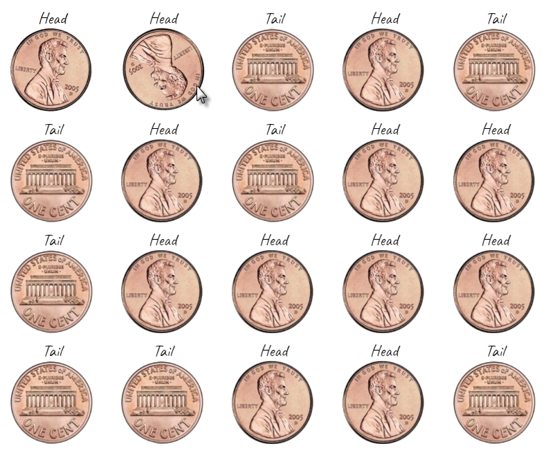

link:  https://ev-ran.github.io/Coins_dropping/
## Coin Object
 In this exercise:
*  Created a coin object with methods and properties.
* Set timeout for every step in loop - for enter-effect.
*  CSS-animation was used for enter-effect.
*  CSS - transition was used for over-effect.

